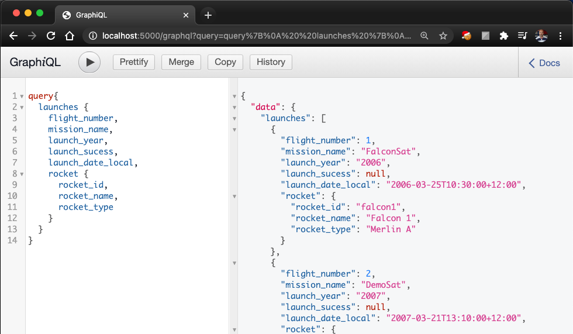
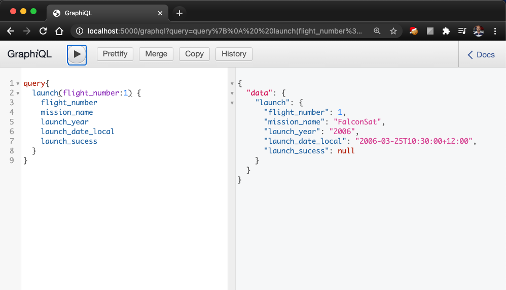

# Graphql React, Apollo, Express and Graphql Server

## Graphql Practice Project 3

In this exercise I followed the series of tutorials by [Traversy Media](https://www.youtube.com/channel/UC29ju8bIPH5as8OGnQzwJyA) to create the. 

[GraphQL With React & Apollo](https://www.youtube.com/watch?v=SEMTj8w04Z8&list=PLillGF-RfqbZrjw48EXLdM4dsOhURCLZx) by Traversy Media](https://www.youtube.com/channel/UC29ju8bIPH5as8OGnQzwJyA)

This app uses [SpaceX API](https://github.com/r-spacex/SpaceX-API)

## Installation

Run

`$ npm init`

	- add description
	- set entry point to ‘server.js’
	- add author’s name (yours)
	- set license to ‘MIT’

Install dependencies

Run

`$ npm install graphql express-graphql express axios`

Install dev dependencies

Run 

`$ npm i -D nodemon`

## Sample Code Screenshots

 
<small>Sample Query: Launches</small>

 
<small>Sample Query: Launch</small>

